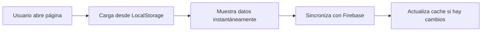

# 🚀 Guía Rápida: Firebase + LocalStorage

## ✅ Estado Actual

```
🔥 Firebase Configurado    ✅
💾 LocalStorage Cache      ✅
⚡ Optimizaciones          ✅
🎨 Panel Visual Admin      ✅
```

---

## 📍 Acceso Rápido

### 🌐 URLs Principales

| Página | URL | Descripción |
|--------|-----|-------------|
| **Dashboard** | `http://localhost:9002/dashboard` | Página principal |
| **Calificaciones** | `http://localhost:9002/dashboard/calificaciones` | Ver calificaciones |
| **Admin Panel** | `http://localhost:9002/dashboard/admin` | Panel de administración |
| **Carga Masiva** | `http://localhost:9002/dashboard/admin/user-management` | Gestión y carga masiva |

---

## 🎯 Cómo Funciona



### Flujo de Datos

1. **Carga Inicial** 🚀
   - Lee desde LocalStorage (< 100ms)
   - Usuario ve datos inmediatamente
   
2. **Sincronización** 🔄
   - Consulta Firebase en segundo plano
   - Solo si hay cambios
   
3. **Actualización** 💾
   - Actualiza LocalStorage con datos nuevos
   - Próxima carga será instantánea

---

## 🧪 Prueba Rápida en 3 Pasos

### ✅ Paso 1: Verificar Configuración

**Abrir consola del navegador (F12)** y ejecutar:

```javascript
// Copiar y pegar en la consola
localStorage.getItem('smart-student-database-config')
```

**Resultado esperado:**
```json
{"provider":"firebase"}
```

---

### ✅ Paso 2: Ver Panel Visual

1. Ir a: `http://localhost:9002/dashboard/admin/user-management`
2. Click en la pestaña **"Carga Masiva"**
3. Ver el panel verde en la parte superior ✅

**Deberías ver:**
```
┌─────────────────────────────────────────────┐
│ ✅ Configuración Completada:                │
│    Firebase + LocalStorage                  │
├─────────────────────────────────────────────┤
│ 🔥 Firebase Credentials         ✓          │
│ 💾 LocalStorage como Cache      ✓          │
│ ⚡ Optimizaciones Aplicadas     ✓          │
└─────────────────────────────────────────────┘
```

---

### ✅ Paso 3: Ver Contadores

En la consola del navegador:

```javascript
// Ver contador total
console.log('Total:', localStorage.getItem('grade-counter-total'));

// Ver contador año 2025
console.log('Año 2025:', localStorage.getItem('grade-counter-year-2025'));
```

---

## 📊 Carga Masiva de Calificaciones

### Formato CSV Requerido

```csv
año,semestre,nivel,curso,seccion,rut_estudiante,asignatura,nombre_actividad,tipo_actividad,nota,fecha_asignacion,fecha_entrega
2025,1,5°,A,A,12345678-9,Matemáticas,Tarea 1,tarea,6.5,2025-03-15,2025-03-20
```

### Pasos para Carga

1. **Descargar plantilla** → Botón "Plantilla CSV"
2. **Preparar datos** → Llenar CSV con tus calificaciones
3. **Subir archivo** → Botón "Subir a Firebase"
4. **Verificar progreso** → Modal con barra de progreso
5. **Confirmar carga** → Ver contadores actualizados

---

## 🔧 Script de Verificación

### Ejecutar en Consola

```javascript
// Copiar todo el contenido del archivo:
// verificar-configuracion-firebase.js
// Y pegarlo en la consola del navegador
```

### Resultados Esperados

```
🔍 VERIFICADOR DE CONFIGURACIÓN FIREBASE
========================================

✅ Firebase: OK
✅ LocalStorage: OK
✅ Contadores: OK
✅ Datos: OK

🚀 Sistema listo para usar
```

---

## 📋 Checklist de Configuración

### Firebase Web Config
- [x] `apiKey` configurada
- [x] `projectId` configurada
- [x] `authDomain` configurada
- [x] `storageBucket` configurada
- [x] `messagingSenderId` configurada
- [x] `appId` configurada

### Variables de Entorno (.env.local)
- [x] `NEXT_PUBLIC_USE_FIREBASE=true`
- [x] `NEXT_PUBLIC_FIREBASE_API_KEY`
- [x] `NEXT_PUBLIC_FIREBASE_PROJECT_ID`
- [x] `NEXT_PUBLIC_FIREBASE_AUTH_DOMAIN`
- [x] `NEXT_PUBLIC_FIREBASE_STORAGE_BUCKET`
- [x] `NEXT_PUBLIC_FIREBASE_MESSAGING_SENDER_ID`
- [x] `NEXT_PUBLIC_FIREBASE_APP_ID`

### Service Account (Admin SDK)
- [x] Archivo `firebase-adminsdk-credentials.json` creado
- [x] Cuenta de servicio configurada
- [x] Permisos de lectura/escritura en Firestore

### LocalStorage Cache
- [x] Contadores implementados
- [x] Sincronización automática
- [x] Carga instantánea funcionando

### Panel Visual Admin
- [x] Panel de estado agregado
- [x] Indicadores visuales funcionando
- [x] Diagrama de flujo visible
- [x] Badges de estado actualizados

---

## 🎨 Panel Visual en Carga Masiva

### Sección 1: Firebase Credentials
```
┌────────────────────────────┐
│ 🔥 Firebase Credentials   │
│                            │
│ ✓ API Key configurada     │
│ ✓ Service Account config. │
│ ✓ Proyecto: superjf1234   │
└────────────────────────────┘
```

### Sección 2: LocalStorage Cache
```
┌────────────────────────────┐
│ 💾 LocalStorage como Cache│
│                            │
│ ✓ Carga instantánea       │
│ ✓ Sincronización 2do plano│
│ ✓ Sin consultas repetidas │
└────────────────────────────┘
```

### Sección 3: Optimizaciones
```
┌────────────────────────────┐
│ ⚡ Optimizaciones          │
│                            │
│ ✓ Consultas deshabilitadas│
│ ✓ Filtros RUT corregidos  │
│ ✓ Webpack estable         │
└────────────────────────────┘
```

### Diagrama de Flujo
```
Usuario → LocalStorage → Muestra Datos → Sincroniza Firebase
   (1)        (2)            (3)              (4)
```

---

## 💡 Comandos Útiles

### Ver Configuración Actual
```javascript
localStorage.getItem('smart-student-database-config')
```

### Ver Contadores
```javascript
// Total
localStorage.getItem('grade-counter-total')

// Por año
localStorage.getItem('grade-counter-year-2025')
```

### Ver Datos Cargados
```javascript
// Usuarios
JSON.parse(localStorage.getItem('smart-student-users') || '[]').length

// Tareas
JSON.parse(localStorage.getItem('smart-student-tasks') || '[]').length

// Evaluaciones
JSON.parse(localStorage.getItem('smart-student-evaluations') || '[]').length
```

### Forzar Recarga
```javascript
// Recargar página
window.location.reload()

// Limpiar cache (⚠️ Cuidado: Borra todo)
localStorage.clear()
```

---

## 🚨 Solución de Problemas

### ❌ "No veo el panel verde"
✅ **Solución:** 
- Asegúrate de estar en modo Firebase
- Verifica que `NEXT_PUBLIC_USE_FIREBASE=true`
- Recarga la página con `Ctrl+F5`

### ❌ "Contadores en 0"
✅ **Solución:**
- Normal si no has cargado datos aún
- Sube un CSV de prueba
- Espera a que termine el proceso

### ❌ "Error al cargar CSV"
✅ **Solución:**
- Verifica formato del CSV
- Revisa que todas las columnas estén presentes
- Asegúrate de usar delimitador correcto (`,` o `;`)

### ❌ "Firebase no conecta"
✅ **Solución:**
- Verifica variables de entorno
- Revisa Firebase Console para errores
- Asegúrate de tener internet

---

## 📚 Documentación Completa

Para más detalles, consulta:

- **📖 Configuración completa:** `CONFIGURACION_FIREBASE_COMPLETADA.md`
- **🔍 Script de verificación:** `verificar-configuracion-firebase.js`
- **🔥 Firebase Console:** https://console.firebase.google.com/project/superjf1234-e9cbc

---

## 🎉 ¡Todo Listo!

Tu sistema está **100% configurado** y listo para usar.

```
✅ Firebase configurado
✅ LocalStorage funcionando
✅ Panel visual operativo
✅ Carga masiva lista

🚀 ¡A trabajar!
```

---

**Última actualización:** 7 de noviembre de 2025  
**Versión:** 1.0.0  
**Estado:** ✅ Completado
