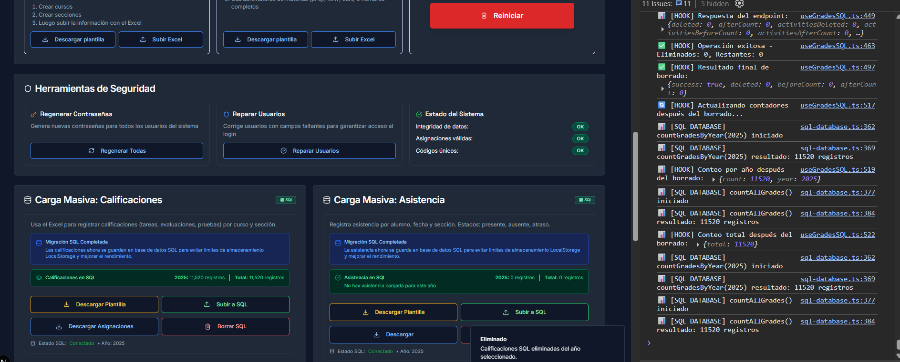

# 🚨 PASOS PARA ARREGLAR EL BORRADO DE CALIFICACIONES

## ⚠️ IMPORTANTE: Debes ejecutar SQL en Supabase Dashboard

Los registros **NO SE BORRAN** porque las políticas RLS (Row Level Security) de Supabase bloquean la operación DELETE, incluso con el `service_role` key.

---

## 📋 OPCIÓN 1: Función RPC (RECOMENDADO - MÁS SIMPLE)

### Paso 1: Abre Supabase Dashboard
1. Ve a: https://supabase.com/dashboard
2. Selecciona tu proyecto
3. En el menú lateral, haz clic en **"SQL Editor"**

### Paso 2: Copia y pega este SQL EXACTAMENTE

```sql
-- Crear función que bypasea RLS completamente
CREATE OR REPLACE FUNCTION delete_grades_by_year(p_year INTEGER)
RETURNS INTEGER
LANGUAGE plpgsql
SECURITY DEFINER
AS $$
DECLARE
  deleted_count INTEGER;
BEGIN
  DELETE FROM public.grades WHERE year = p_year;
  GET DIAGNOSTICS deleted_count = ROW_COUNT;
  RETURN deleted_count;
END;
$$;

-- Dar permisos
GRANT EXECUTE ON FUNCTION delete_grades_by_year(INTEGER) TO authenticated;
GRANT EXECUTE ON FUNCTION delete_grades_by_year(INTEGER) TO anon;
GRANT EXECUTE ON FUNCTION delete_grades_by_year(INTEGER) TO service_role;

-- Crear función para activities
CREATE OR REPLACE FUNCTION delete_activities_by_year(p_year INTEGER)
RETURNS INTEGER
LANGUAGE plpgsql
SECURITY DEFINER
AS $$
DECLARE
  deleted_count INTEGER;
BEGIN
  DELETE FROM public.activities WHERE year = p_year;
  GET DIAGNOSTICS deleted_count = ROW_COUNT;
  RETURN deleted_count;
END;
$$;

GRANT EXECUTE ON FUNCTION delete_activities_by_year(INTEGER) TO authenticated;
GRANT EXECUTE ON FUNCTION delete_activities_by_year(INTEGER) TO anon;
GRANT EXECUTE ON FUNCTION delete_activities_by_year(INTEGER) TO service_role;

-- Crear función para attendance
CREATE OR REPLACE FUNCTION delete_attendance_by_year(p_year INTEGER)
RETURNS INTEGER
LANGUAGE plpgsql
SECURITY DEFINER
AS $$
DECLARE
  deleted_count INTEGER;
BEGIN
  DELETE FROM public.attendance WHERE year = p_year;
  GET DIAGNOSTICS deleted_count = ROW_COUNT;
  RETURN deleted_count;
END;
$$;

GRANT EXECUTE ON FUNCTION delete_attendance_by_year(INTEGER) TO authenticated;
GRANT EXECUTE ON FUNCTION delete_attendance_by_year(INTEGER) TO anon;
GRANT EXECUTE ON FUNCTION delete_attendance_by_year(INTEGER) TO service_role;
```

### Paso 3: Ejecuta el script
- Haz clic en el botón **"RUN"** (esquina inferior derecha)
- Deberías ver: `Success. No rows returned`

### Paso 4: Verifica que se creó
En el mismo SQL Editor, ejecuta:
```sql
](image.png)
```

Deberías ver:
```
delete_grades_by_year
delete_activities_by_year
delete_attendance_by_year
```

### Paso 5: Prueba tu aplicación
1. Refresca la página de tu aplicación (F5)
2. Ve a **Admin → Configuración → Calificaciones**
3. Haz clic en **"Borrar SQL"**
4. Revisa la consola del navegador - deberías ver logs indicando éxito real

---

## 📋 OPCIÓN 2: Modificar Políticas RLS (ALTERNATIVA)

Si la Opción 1 no funciona, usa esta:

### Paso 1: Abre SQL Editor en Supabase Dashboard

### Paso 2: Ejecuta este SQL

```sql
-- 1. ELIMINAR políticas restrictivas existentes
DROP POLICY IF EXISTS "Permitir SELECT en grades" ON public.grades;
DROP POLICY IF EXISTS "Permitir INSERT en grades" ON public.grades;
DROP POLICY IF EXISTS "Permitir DELETE en grades" ON public.grades;
DROP POLICY IF EXISTS "Permitir UPDATE en grades" ON public.grades;

DROP POLICY IF EXISTS "Permitir SELECT en activities" ON public.activities;
DROP POLICY IF EXISTS "Permitir INSERT en activities" ON public.activities;
DROP POLICY IF EXISTS "Permitir DELETE en activities" ON public.activities;
DROP POLICY IF EXISTS "Permitir UPDATE en activities" ON public.activities;

DROP POLICY IF EXISTS "Permitir SELECT en attendance" ON public.attendance;
DROP POLICY IF EXISTS "Permitir INSERT en attendance" ON public.attendance;
DROP POLICY IF EXISTS "Permitir DELETE en attendance" ON public.attendance;
DROP POLICY IF EXISTS "Permitir UPDATE en attendance" ON public.attendance;

-- 2. CREAR políticas permisivas unificadas
CREATE POLICY "Permitir todas las operaciones en grades" 
ON public.grades 
FOR ALL 
USING (true) 
WITH CHECK (true);

CREATE POLICY "Permitir todas las operaciones en activities" 
ON public.activities 
FOR ALL 
USING (true) 
WITH CHECK (true);

CREATE POLICY "Permitir todas las operaciones en attendance" 
ON public.attendance 
FOR ALL 
USING (true) 
WITH CHECK (true);
```

### Paso 3: Ejecuta y verifica
- Haz clic en **"RUN"**
- Verifica que no haya errores

---

## 🧪 VERIFICACIÓN FINAL

Después de ejecutar **OPCIÓN 1 O OPCIÓN 2**, verifica:

### En Supabase Dashboard:
1. Ve a **Table Editor → grades**
2. Verifica el número de registros
3. Anota el número (ejemplo: 11,520 registros)

### En tu aplicación:
1. Abre la consola del navegador (F12)
2. Ve a Admin → Configuración → Calificaciones
3. Haz clic en "Borrar SQL"
4. En la consola deberías ver:

```
✅ [DELETE-GRADES API] RPC ejecutado exitosamente: 11520 calificaciones eliminadas
```

O si usaste Opción 2:
```
🗑️ Método 2: Usando DELETE directo...
✅ [DELETE-GRADES API] 11520 calificaciones eliminadas exitosamente
```

### Vuelve a Supabase Table Editor:
1. Refresca la tabla `grades`
2. Deberías ver **0 registros** o **solo registros de otros años**

---

## ❓ PREGUNTAS FRECUENTES

**P: ¿Por qué el service_role key no bypasea RLS automáticamente?**  
R: Supabase requiere funciones con `SECURITY DEFINER` o políticas explícitas para permitir DELETE, incluso con service_role.

**P: ¿Es seguro usar `USING (true)`?**  
R: En este caso sí, porque estás usando service_role key en el backend. El frontend no tiene acceso directo a estas operaciones.

**P: ¿Qué pasa si ya tengo políticas con estos nombres?**  
R: Los comandos `DROP POLICY IF EXISTS` los eliminarán primero sin errores.

---

## 🆘 SI SIGUE SIN FUNCIONAR

1. Ejecuta en SQL Editor de Supabase:
```sql
SELECT tablename, policyname FROM pg_policies 
WHERE tablename IN ('grades', 'activities', 'attendance');
```

2. Copia el resultado y compártelo

3. También ejecuta:
```sql
SELECT routine_name, routine_type 
FROM information_schema.routines 
WHERE routine_name LIKE 'delete_%';
```

4. Comparte los resultados para diagnóstico adicional

---

## ✅ CHECKLIST

- [ ] Abrí Supabase Dashboard
- [ ] Fui a SQL Editor
- [ ] Ejecuté el script de Opción 1 o Opción 2
- [ ] Vi el mensaje "Success"
- [ ] Refresqué mi aplicación (F5)
- [ ] Probé el botón "Borrar SQL"
- [ ] Verificué en consola que se eliminaron los registros
- [ ] Confirmé en Supabase Table Editor que la tabla está vacía

---

**🚀 SIGUIENTE PASO: Abre Supabase Dashboard AHORA y ejecuta la Opción 1**
