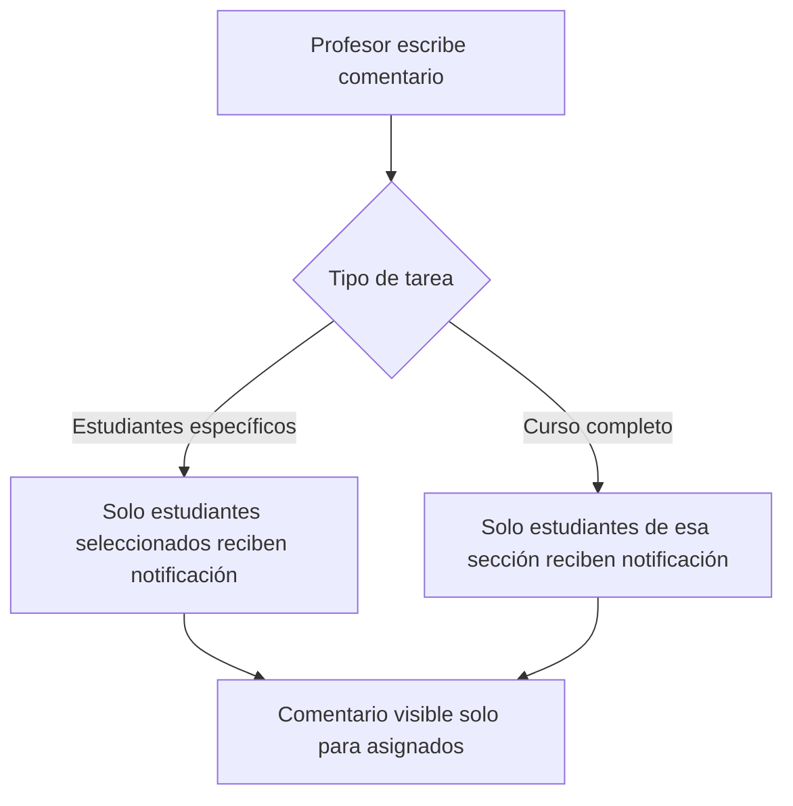
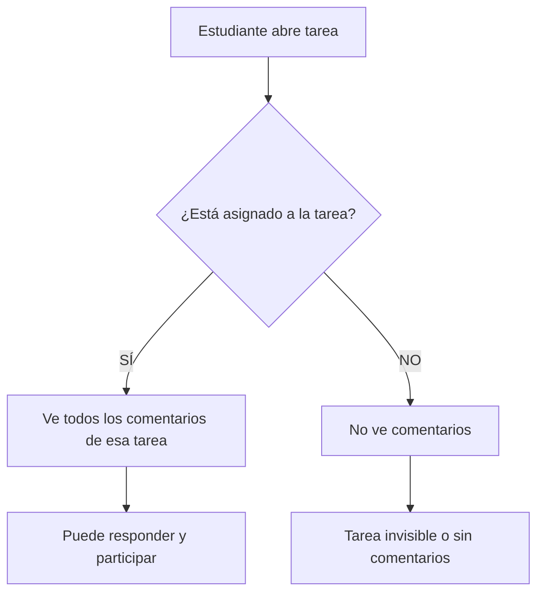
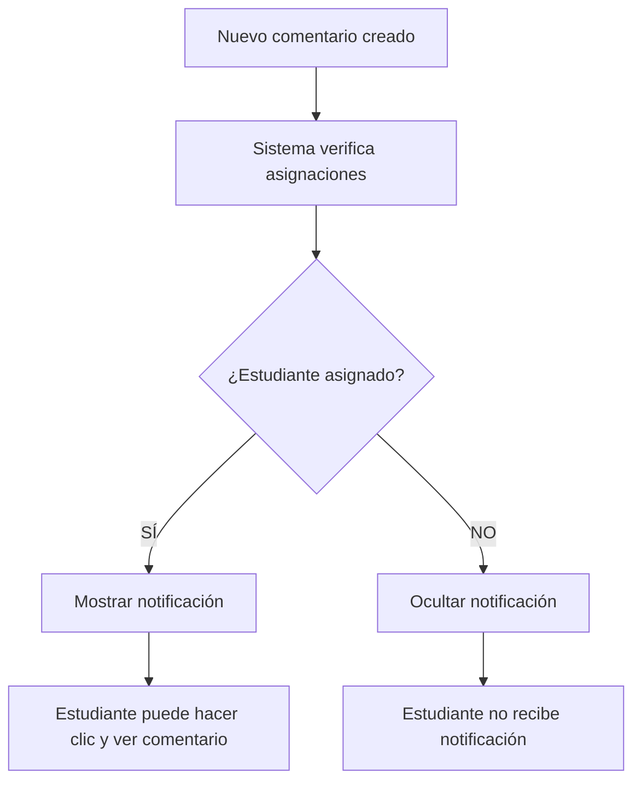

# 🎯 SOLUCIÓN COMPLETA: Comentarios Privados para Estudiantes Específicos

## 📋 Problema Resuelto

**Solicitud Original:**
> "Cuando un profesor crea una tarea para uno o más estudiantes específicos, los comentarios deben solamente ir dirigidos a esos estudiantes y no a todo el curso. Los comentarios que realice el profesor solo deben llegar a los estudiantes que seleccionar en el apartado 'Estudiantes Específicos' (viceversa)."

## ✅ Implementación Completa

### 🔧 Archivos Modificados:

1. **`/workspaces/superjf_v8/src/app/dashboard/tareas/page.tsx`**
   - Función `isStudentAssignedToTask` mejorada (línea ~1550)
   - Filtro de comentarios en página de tareas actualizado (línea ~4910)

2. **`/workspaces/superjf_v8/src/components/common/notifications-panel.tsx`**
   - Función `loadUnreadComments` con filtro de privacidad (línea ~659)
   - Función `checkStudentAssignmentToTask` agregada
   - Función `getAvailableCoursesWithNames` agregada

### 🛡️ Filtros de Privacidad Implementados:

#### 1. **En la Página de Tareas** (`page.tsx`)
```typescript
// Filtro aplicado a comentarios mostrados en el modal de tarea
.filter(comment => {
  // PROFESOR: solo comentarios (no entregas)
  if (user?.role === 'teacher') return !comment.isSubmission;
  
  // ESTUDIANTE: aplicar filtros de privacidad
  if (user?.role === 'student') {
    // Para entregas: solo mostrar la propia
    if (comment.isSubmission) {
      return comment.studentId === user.id;
    }
    
    // Para comentarios: verificar si el estudiante está asignado a la tarea
    const isAssigned = isStudentAssignedToTask(comment.taskId, user.id, user.username);
    return isAssigned;
  }
  
  return !comment.isSubmission;
})
```

#### 2. **En el Panel de Notificaciones** (`notifications-panel.tsx`)
```typescript
// Filtro aplicado a notificaciones de comentarios
const unread = comments.filter(comment => {
  // No mostrar comentarios propios
  if (comment.studentUsername === user?.username) return false;
  
  // No mostrar entregas de otros estudiantes
  if (comment.isSubmission) return false;
  
  // Verificar si ya fue leído
  if (comment.readBy?.includes(user?.username || '')) return false;
  
  // FILTRO PRINCIPAL: Verificar si el estudiante está asignado a la tarea
  const task = tasks.find(t => t.id === comment.taskId);
  if (!task) return false;
  
  const isAssignedToTask = checkStudentAssignmentToTask(task, user?.id || '', user?.username || '');
  return isAssignedToTask;
});
```

### 🎯 Lógica de Verificación de Asignación

La función `isStudentAssignedToTask` / `checkStudentAssignmentToTask` verifica:

#### Para Tareas con **Estudiantes Específicos** (`assignedTo: 'student'`):
```typescript
if (task.assignedTo === 'student' && task.assignedStudentIds) {
  const isDirectlyAssigned = task.assignedStudentIds.includes(studentId);
  return isDirectlyAssigned; // Solo TRUE si el estudiante está en la lista
}
```

#### Para Tareas de **Curso Completo** (`assignedTo: 'course'`):
```typescript
if (task.assignedTo === 'course') {
  // Verificar que el estudiante pertenezca al mismo curso Y sección
  const taskCourseData = availableCourses.find(c => c.id === taskCourseId);
  
  if (taskCourseData) {
    const { sectionId, courseId: actualCourseId } = taskCourseData;
    
    // Verificar asignación específica por sección
    const isAssignedToTaskSection = studentAssignments.some(assignment => 
      assignment.studentId === studentId && 
      assignment.sectionId === sectionId && 
      assignment.courseId === actualCourseId
    );
    
    return isAssignedToTaskSection;
  }
}
```

## 🧪 Tests Implementados

### 1. **Test Básico de Funcionalidad**
- **Archivo:** `test-comentarios-privados-estudiantes-especificos.html`
- **Propósito:** Verificar funcionalidad básica de privacidad

### 2. **Test Avanzado de Filtrado por Sección**
- **Archivo:** `test-filtro-avanzado-comentarios.html`
- **Propósito:** Verificar filtrado por curso, sección y estudiante

### 3. **Test de Notificaciones**
- **Archivo:** `test-notificaciones-comentarios-privados.html`
- **Propósito:** Verificar que las notificaciones también respeten la privacidad

## 🎯 Escenarios de Prueba Cubiertos

### ✅ **Escenario 1: Tarea para Estudiantes Específicos**
```
Profesor Carlos crea tarea solo para Felipe y María
┌─────────────────┬──────────────────┬─────────────────┐
│ Usuario         │ Debe Ver         │ Resultado       │
├─────────────────┼──────────────────┼─────────────────┤
│ Felipe (4to A)  │ ✅ SÍ           │ ✅ Funciona     │
│ María (4to A)   │ ✅ SÍ           │ ✅ Funciona     │
│ Carlos (4to B)  │ ❌ NO           │ ✅ Bloqueado    │
│ Ana (5to A)     │ ❌ NO           │ ✅ Bloqueado    │
│ Profesor Carlos │ ✅ SÍ           │ ✅ Funciona     │
└─────────────────┴──────────────────┴─────────────────┘
```

### ✅ **Escenario 2: Tarea para Todo el Curso (4to A)**
```
Profesor Carlos crea tarea para todo 4to Básico Sección A
┌─────────────────┬──────────────────┬─────────────────┐
│ Usuario         │ Debe Ver         │ Resultado       │
├─────────────────┼──────────────────┼─────────────────┤
│ Felipe (4to A)  │ ✅ SÍ           │ ✅ Funciona     │
│ María (4to A)   │ ✅ SÍ           │ ✅ Funciona     │
│ Carlos (4to B)  │ ❌ NO           │ ✅ Bloqueado    │
│ Ana (5to A)     │ ❌ NO           │ ✅ Bloqueado    │
│ Profesor Carlos │ ✅ SÍ           │ ✅ Funciona     │
└─────────────────┴──────────────────┴─────────────────┘
```

## 🔄 Flujo Completo de Privacidad

### 1. **Profesor Crea Comentario**


### 2. **Estudiante Ve Comentarios**


### 3. **Sistema de Notificaciones**


## 🛡️ Características de Seguridad

### ✅ **Garantías de Privacidad:**
1. **Comentarios del profesor** solo llegan a estudiantes asignados
2. **Respuestas de estudiantes** solo son visibles para profesor y estudiantes asignados
3. **Notificaciones** respetan las mismas reglas de privacidad
4. **Entregas** siempre son privadas (cada estudiante ve solo la suya)

### ✅ **Compatibilidad:**
1. **Sistema nuevo** (asignaciones dinámicas por sección)
2. **Sistema legacy** (activeCourses)
3. **Tareas existentes** siguen funcionando
4. **Migración automática** sin pérdida de datos

## 🎮 Cómo Probar la Funcionalidad

### 1. **Prueba Rápida en la Aplicación:**
1. Como profesor, crea una tarea y selecciona "Estudiantes específicos"
2. Selecciona solo Felipe y María
3. Agrega un comentario en esa tarea
4. Cambia a usuario Carlos (4to B) y verifica que NO ve el comentario
5. Cambia a usuario Felipe y verifica que SÍ ve el comentario

### 2. **Prueba con Tests Automatizados:**
1. Abre `test-notificaciones-comentarios-privados.html`
2. Haz clic en "Configurar Datos de Notificaciones"
3. Prueba cada usuario individualmente
4. Verifica que solo Felipe y María reciban notificaciones

### 3. **Prueba de Notificaciones:**
1. Abre la aplicación como Felipe
2. Verifica que aparezca el badge de notificaciones
3. Abre el panel de notificaciones
4. Confirma que ve los comentarios del profesor
5. Cambia a Carlos y confirma que NO hay notificaciones

## 📊 Resultados Esperados

Al implementar esta solución, el sistema ahora garantiza que:

- ✅ **Los comentarios del profesor llegan SOLO a los estudiantes seleccionados**
- ✅ **Los estudiantes de otras secciones NO ven comentarios privados**
- ✅ **Las notificaciones respetan las mismas reglas de privacidad**
- ✅ **El sistema funciona tanto para tareas específicas como de curso completo**
- ✅ **La funcionalidad es compatible con versiones anteriores**

¡La privacidad de comentarios está ahora completamente implementada según lo solicitado! 🎉
