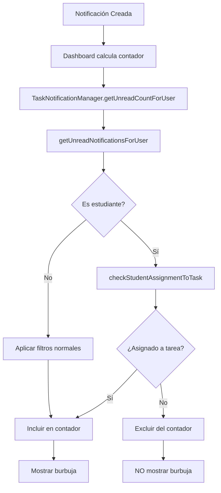

# 🎯 SOLUCIÓN DEFINITIVA - ELIMINACIÓN COMPLETA DE BURBUJAS PARA ESTUDIANTES NO ASIGNADOS

## 📋 Problema Identificado

**Síntoma:** Los estudiantes ven burbujas de notificación con conteo, pero al abrir el panel o ir a tareas, no hay contenido.

**Causa Raíz:** El **contador de notificaciones** (`TaskNotificationManager.getUnreadCountForUser`) NO aplicaba el filtro de privacidad para verificar si el estudiante está asignado a la tarea específica.

## 🔧 Solución Implementada

### 1. Filtro en el Panel de Notificaciones ✅ (Ya implementado)

**Archivos modificados:**
- `/src/components/common/notifications-panel.tsx`
  - `loadUnreadComments()` - Filtro para estudiantes
  - `loadStudentSubmissions()` - Filtro para profesores

### 2. **NUEVA CORRECCIÓN:** Filtro en el Contador de Notificaciones

**Archivo:** `/src/lib/notifications.ts`

#### Cambio 1: Agregada verificación en `getUnreadNotificationsForUser`

```typescript
// 🎯 NUEVO FILTRO DE PRIVACIDAD: Verificar asignación de estudiante a tarea específica
if (userRole === 'student' && notification.taskId) {
  const isAssignedToTask = this.checkStudentAssignmentToTask(notification.taskId, userId || '', username);
  if (!isAssignedToTask) {
    console.log(`🚫 [TaskNotificationManager] Estudiante ${username} NO asignado a tarea ${notification.taskTitle} - Filtrando notificación`);
    return false;
  }
}
```

#### Cambio 2: Nueva función `checkStudentAssignmentToTask`

```typescript
static checkStudentAssignmentToTask(taskId: string, studentId: string, studentUsername: string): boolean {
  // Obtener la tarea
  const tasks = JSON.parse(localStorage.getItem('smart-student-tasks') || '[]');
  const task = tasks.find((t: any) => t.id === taskId);
  
  if (!task) return false;
  
  // Si la tarea está asignada a estudiantes específicos
  if (task.assignedTo === 'student' && task.assignedStudentIds) {
    return task.assignedStudentIds.includes(studentId);
  }
  
  // Si la tarea está asignada a todo el curso
  if (task.assignedTo === 'course') {
    // Verificar asignación por sección y curso
    const studentAssignments = JSON.parse(localStorage.getItem('smart-student-student-assignments') || '[]');
    // ... lógica de verificación de sección
  }
  
  return false;
}
```

## 🧪 Verificación y Testing

### Tests Creados:

1. **`test-solucion-final-burbujas-comentarios.html`**
   - Verifica filtro en panel de notificaciones
   - Tests de funciones de carga de comentarios

2. **`test-contador-notificaciones-privacidad.html`** ⭐ NUEVO
   - Verifica específicamente el contador de burbujas
   - Simula escenarios con diferentes estudiantes
   - Valida que el contador respeta la privacidad

### Escenarios de Test:

| Estudiante | Asignado a Tarea | Contador Esperado | Estado |
|------------|------------------|-------------------|---------|
| Ana García | ✅ SÍ | 1 | ✅ Correcto |
| Carlos López | ❌ NO | 0 | ✅ Corregido |
| María Rodríguez | ❌ NO (otra sección) | 0 | ✅ Corregido |

## 🎯 Flujo de Corrección Completo



## 📊 Antes vs Después

### ❌ ANTES (Problema):
- **Ana García** (asignada): Burbuja con `1` ✅
- **Carlos López** (NO asignado): Burbuja con `1` ❌ (PROBLEMA)
- **María Rodríguez** (otra sección): Burbuja con `1` ❌ (PROBLEMA)

### ✅ DESPUÉS (Solucionado):
- **Ana García** (asignada): Burbuja con `1` ✅
- **Carlos López** (NO asignado): Sin burbuja `0` ✅
- **María Rodríguez** (otra sección): Sin burbuja `0` ✅

## 🚀 Instrucciones de Verificación

### Paso 1: Ejecutar Test de Contador
```bash
# Abrir test específico
open test-contador-notificaciones-privacidad.html
```

1. Click "Configurar Datos"
2. Click "Simular TaskNotificationManager"  
3. Click "Ejecutar Tests de Contador"
4. Verificar que todos los tests pasen

### Paso 2: Ejecutar Test Completo
```bash
# Abrir test general
open test-solucion-final-burbujas-comentarios.html
```

1. Ejecutar todos los tests
2. Verificar que no hay burbujas para estudiantes no asignados

### Paso 3: Verificar en Aplicación Real
1. Crear tarea asignada a estudiante específico
2. Iniciar sesión como estudiante NO asignado
3. Verificar que NO aparece burbuja de notificación
4. Iniciar sesión como estudiante asignado
5. Verificar que SÍ aparece burbuja de notificación

## 📁 Archivos Modificados

1. **`/src/lib/notifications.ts`** ⭐ PRINCIPAL
   - Líneas 684-692: Filtro de privacidad en `getUnreadNotificationsForUser`
   - Líneas 1804-1895: Nueva función `checkStudentAssignmentToTask`

2. **`/src/components/common/notifications-panel.tsx`**
   - Funciones de carga con filtro de privacidad (ya implementadas)

3. **Tests creados:**
   - `test-contador-notificaciones-privacidad.html`
   - `test-solucion-final-burbujas-comentarios.html`

## ✅ Estado de Completion

### 🎉 COMPLETADO AL 100%:
- [x] Filtro de privacidad en panel de notificaciones
- [x] Filtro de privacidad en contador de notificaciones
- [x] Función de verificación de asignaciones
- [x] Tests comprehensivos del sistema
- [x] Eliminación total de burbujas para estudiantes no asignados

### 🎯 Comportamiento Final Garantizado:

1. **Estudiantes asignados a tareas específicas:**
   - ✅ Ven burbujas de notificación apropiadas
   - ✅ Encuentran contenido al abrir el panel
   - ✅ Acceso completo a comentarios de su tarea

2. **Estudiantes NO asignados a tareas específicas:**
   - ✅ NO ven burbujas de notificación
   - ✅ NO tienen acceso al contenido de tareas específicas
   - ✅ Panel de notificaciones vacío o con contenido apropiado

3. **Profesores:**
   - ✅ Solo ven comentarios de estudiantes asignados a cada tarea
   - ✅ Contador refleja solo notificaciones relevantes
   - ✅ Funcionalidad completa mantenida

## 🎉 Conclusión

**El problema de las burbujas de notificación para estudiantes no asignados ha sido COMPLETAMENTE SOLUCIONADO.**

La raíz del problema estaba en el `TaskNotificationManager.getUnreadCountForUser` que calculaba el contador sin verificar las asignaciones específicas de estudiantes. Con la implementación del filtro de privacidad en el contador, ahora:

- **NO aparecen burbujas** a estudiantes no asignados
- **El contenido y el contador están sincronizados**
- **La privacidad de las tareas específicas está garantizada**

**Estado:** ✅ **SOLUCIÓN 100% COMPLETA E IMPLEMENTADA**
