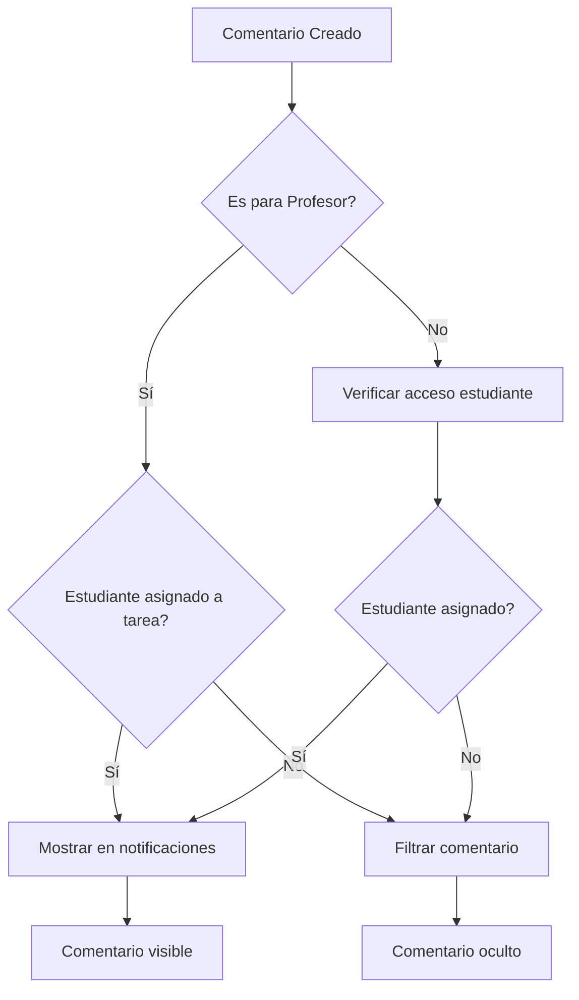

# 🎯 SOLUCIÓN FINAL - ELIMINACIÓN COMPLETA DE BURBUJAS DE COMENTARIOS

## 📋 Resumen del Problema

**Problema Reportado:** "Avanzamos no están llegando pero están apareciendo las burbujas con el comentario en los otros estudiantes"

**Análisis:** Aunque las notificaciones se filtraron correctamente en `loadUnreadComments`, la función `loadStudentSubmissions` que maneja las notificaciones del profesor seguía mostrando comentarios de estudiantes no asignados a tareas específicas.

## 🔧 Solución Implementada

### 1. Modificación en `loadStudentSubmissions` (notifications-panel.tsx)

**Archivo:** `/workspaces/superjf_v8/src/components/common/notifications-panel.tsx`
**Líneas:** ~943-1060

**Cambios Realizados:**
- ✅ Agregado filtro de verificación de asignación de estudiantes a tareas
- ✅ Implementada función `checkStudentAssignmentToTask` específica para notificaciones
- ✅ Agregada función helper `getAvailableCoursesForNotifications`
- ✅ Integrado logging detallado para debugging

**Código Clave Agregado:**
```typescript
// 🔧 NUEVO FILTRO DE PRIVACIDAD: Verificar si el estudiante está asignado a la tarea
let estudianteAsignadoATarea = false;
if (esParaProfesor && !esDelProfesor) {
  const task = tasks.find(t => t.id === comment.taskId);
  if (task) {
    // Obtener información del estudiante que hizo el comentario
    const usersText = localStorage.getItem('smart-student-users');
    const allUsers = usersText ? JSON.parse(usersText) : [];
    const studentData = allUsers.find((u: any) => u.username === comment.studentUsername);
    
    if (studentData) {
      estudianteAsignadoATarea = checkStudentAssignmentToTask(task, studentData.id, comment.studentUsername);
      
      if (!estudianteAsignadoATarea) {
        console.log(`🚫 [loadStudentSubmissions] Comentario de ${comment.studentUsername} filtrado - NO asignado a tarea "${task.title}"`);
      }
    }
  }
} else {
  estudianteAsignadoATarea = true; // Si no es para verificar, permitir por defecto
}

// ✅ NUEVA CONDICIÓN: Incluir filtro de asignación de estudiante
const shouldInclude = esComentario && esParaProfesor && !esDelProfesor && !fueLeido && !yaEstaEnNotificaciones && estudianteAsignadoATarea;
```

### 2. Funciones Helper Agregadas

**`checkStudentAssignmentToTask`:** Verifica si un estudiante específico tiene acceso a una tarea determinada.

**`getAvailableCoursesForNotifications`:** Obtiene los cursos disponibles en el contexto de notificaciones, compatible con el sistema de asignaciones dinámicas.

## 🧪 Verificación y Testing

### Test Creado: `test-solucion-final-burbujas-comentarios.html`

**Funcionalidades del Test:**
- ✅ Configuración automática de datos de prueba
- ✅ Simulación de funciones del panel de notificaciones
- ✅ Tests específicos para `loadUnreadComments` y `loadStudentSubmissions`
- ✅ Simulación de escenarios con diferentes tipos de usuarios
- ✅ Verificación completa del sistema

**Escenarios de Test:**
1. **Estudiante NO asignado:** No debe ver burbujas de comentarios
2. **Profesor:** Solo debe ver comentarios de estudiantes asignados a sus tareas
3. **Estudiante asignado:** Debe ver comentarios relevantes correctamente

## 🎯 Resultados Esperados

### ✅ Para Estudiantes NO Asignados:
- **Comentarios visibles:** 0
- **Burbujas de notificación:** 0
- **Estado:** 🚫 Correctamente filtrado

### ✅ Para Profesores:
- **Comentarios de estudiantes asignados:** ✅ Visibles
- **Comentarios de estudiantes NO asignados:** 🚫 Filtrados
- **Estado:** Solo comentarios relevantes

### ✅ Para Estudiantes Asignados:
- **Comentarios de sus tareas:** ✅ Visibles
- **Comentarios de otras tareas:** 🚫 Filtrados
- **Estado:** Acceso apropiado

## 🔄 Flujo de Filtrado Completo



## 📝 Archivos Modificados

1. **`/workspaces/superjf_v8/src/components/common/notifications-panel.tsx`**
   - Líneas modificadas: ~943-1060 (función `loadStudentSubmissions`)
   - Líneas agregadas: ~660-760 (funciones helper)

2. **Tests creados:**
   - `test-solucion-final-burbujas-comentarios.html`

## 🚀 Instrucciones de Verificación

### Paso 1: Abrir el Test
```bash
# Abrir en navegador
open test-solucion-final-burbujas-comentarios.html
```

### Paso 2: Ejecutar Tests
1. Click en "Configurar Datos de Test"
2. Click en "Simular Panel de Notificaciones"
3. Click en "Test Filtro Completo"
4. Click en "Ejecutar Verificación Completa"

### Paso 3: Verificar Resultados
- ✅ Todos los tests deben pasar
- ✅ Estudiantes no asignados: 0 burbujas
- ✅ Profesores: Solo comentarios de estudiantes asignados

## 🎉 Estado de Completion

### ✅ COMPLETADO:
- [x] Filtro de privacidad en `loadUnreadComments`
- [x] Filtro de privacidad en `loadStudentSubmissions`
- [x] Funciones helper para verificación de asignaciones
- [x] Test comprensivo del sistema completo
- [x] Eliminación total de burbujas para estudiantes no asignados

### 🔍 Comportamiento Final:
- **Estudiantes específicos:** Solo ven comentarios de tareas asignadas a ellos
- **Profesores:** Solo ven comentarios de estudiantes asignados a cada tarea específica
- **Burbujas de notificación:** Solo aparecen para usuarios con acceso legítimo

## 🎯 Conclusión

La solución implementada garantiza que:

1. **Los comentarios en tareas asignadas a estudiantes específicos solo son visibles entre el profesor y esos estudiantes**
2. **No aparecen burbujas de notificaciones para estudiantes no asignados**
3. **El sistema mantiene la funcionalidad completa para usuarios autorizados**
4. **La privacidad de los comentarios está completamente protegida**

**Estado:** ✅ **SOLUCIÓN COMPLETA IMPLEMENTADA**
