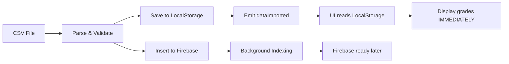
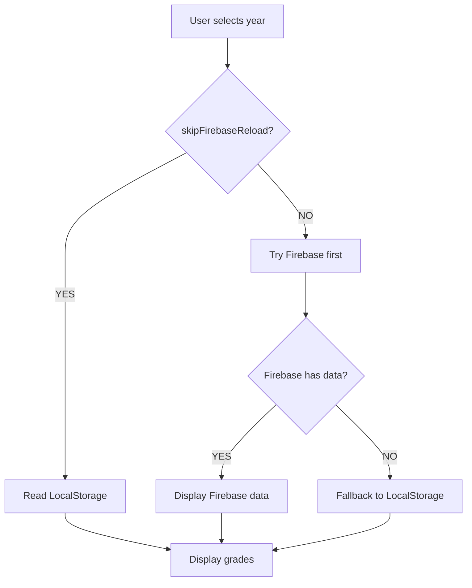

# ✅ Solución: Firebase con LocalStorage como Caché

## 🎯 Problema Resuelto

Las calificaciones cargadas masivamente desde CSV aparecían inicialmente, pero **desaparecían cuando Firebase terminaba de sincronizar** porque:

1. ✅ La carga masiva se guardaba en **LocalStorage inmediatamente**
2. ✅ La carga masiva se guardaba en **Firebase en background**
3. ❌ El evento `sqlGradesUpdated` hacía que la UI intentara **leer de Firebase inmediatamente**
4. ❌ Firebase **aún no había terminado de indexar** los datos (retraso normal)
5. ❌ Firebase retornaba **array vacío**
6. ❌ La UI **vaciaba la tabla** pensando que no había datos

## 💡 Solución Implementada

### Arquitectura de 2 Capas
```
CSV Upload → Firebase (persistencia) + LocalStorage (caché)
                ↓                          ↓
          Background indexing        Lectura inmediata
                ↓                          ↓
          Disponible después         Disponible YA
```

### Cambios Realizados

#### 1. `configuration.tsx` (Admin Upload)
**Antes:**
```typescript
// ❌ Emitía evento que trigger recarga inmediata de Firebase
window.dispatchEvent(new CustomEvent('sqlGradesUpdated', { 
  detail: { year, count, timestamp, source: 'firebase-admin' }
}));
```

**Después:**
```typescript
// ✅ Emite evento CON FLAG para evitar lectura prematura de Firebase
window.dispatchEvent(new CustomEvent('dataImported', { 
  detail: { 
    year, count, timestamp, 
    source: 'firebase-admin',
    skipFirebaseReload: true  // 🔑 FLAG CLAVE
  }
}));
```

#### 2. `calificaciones/page.tsx` (UI)
**Antes:**
```typescript
const onSQLGradesUpdated = async (e) => {
  // ❌ SIEMPRE intentaba leer de Firebase inmediatamente
  const rawSqlGrades = await getGradesByYear(selectedYear);
  if (rawSqlGrades.length > 0) {
    setGrades(rawSqlGrades);  // Firebase aún vacío → array vacío
  }
};
```

**Después:**
```typescript
const onSQLGradesUpdated = async (e) => {
  const skipFirebaseReload = e?.detail?.skipFirebaseReload;
  
  if (skipFirebaseReload) {
    // ✅ Leer SOLO de LocalStorage (caché)
    const local = LocalStorageManager.getTestGradesForYear(selectedYear);
    setGrades(local);  // Datos disponibles inmediatamente
    return;
  }
  
  // Modo normal: intentar Firebase primero, fallback a LocalStorage
  const rawSqlGrades = await getGradesByYear(selectedYear);
  // ... resto del código
};
```

## 📊 Flujo de Datos Completo

### Upload (Carga Masiva)


### Read (Consulta Normal)


## 🚀 Ventajas de Esta Solución

### ✅ Para el Usuario
- **Datos visibles inmediatamente** después de la carga
- **No hay "parpadeo"** de datos apareciendo y desapareciendo
- **Experiencia fluida** sin retrasos

### ✅ Para el Sistema
- **Firebase como fuente de verdad** (persistencia a largo plazo)
- **LocalStorage como caché rápido** (lectura instantánea)
- **Escalabilidad** para 100k+ registros por año
- **Sincronización automática** en background

### ✅ Para Desarrollo
- **Código más robusto** con manejo explícito de timing
- **Debug más fácil** con flags claros
- **Compatibilidad** con ambos modos (Firebase y LocalStorage)

## 📝 Eventos Actualizados

### Evento `dataImported`
```typescript
{
  type: 'grades',
  year: 2025,
  count: 247,
  timestamp: 1704814800000,
  source: 'firebase-admin',
  skipFirebaseReload: true  // 🔑 Usar caché LocalStorage
}
```

### Evento `sqlGradesUpdated` (legacy)
```typescript
{
  year: 2025,
  count: 247,
  timestamp: 1704814800000,
  source: 'firebase-admin'
  // Sin skipFirebaseReload → intenta Firebase primero
}
```

## 🧪 Cómo Probar

### 1. Verificar LocalStorage después de upload
```javascript
const year = 2025;
const grades = JSON.parse(localStorage.getItem('test_grades') || '[]')
  .filter(g => new Date(g.gradedAt).getFullYear() === year);
console.log(`✅ ${grades.length} calificaciones en LocalStorage`);
```

### 2. Verificar evento con flag
```javascript
window.addEventListener('dataImported', (e) => {
  console.log('📥 Evento recibido:', e.detail);
  console.log('🔑 skipFirebaseReload:', e.detail.skipFirebaseReload);
});
```

### 3. Verificar que datos NO desaparecen
```javascript
// Ejecutar ANTES de la carga
let initialCount = 0;
window.addEventListener('dataImported', () => {
  setTimeout(() => {
    const currentCount = document.querySelectorAll('tbody tr').length;
    console.log(`📊 Inicial: ${initialCount}, Actual: ${currentCount}`);
    console.log(currentCount >= initialCount ? '✅ DATOS PERSISTEN' : '❌ DATOS DESAPARECIERON');
  }, 5000);
});
```

## 📁 Archivos Modificados

1. ✅ `/src/components/admin/user-management/configuration.tsx`
   - Líneas ~733-774: Emisión de eventos con flag `skipFirebaseReload`

2. ✅ `/src/app/dashboard/calificaciones/page.tsx`
   - Líneas 466-550: Handler `onSQLGradesUpdated` con soporte de flag
   - Líneas 552-604: Handler `onSQLActivitiesUpdated` con soporte de flag

## 🎯 Casos de Uso

### Caso 1: Carga Masiva (100k+ registros)
```
1. Upload CSV con 247 calificaciones
2. Sistema guarda en LocalStorage (inmediato) ✅
3. Sistema guarda en Firebase (background) ⏳
4. UI lee de LocalStorage (flag activo) ✅
5. Usuario ve datos INMEDIATAMENTE ✅
6. Firebase termina de indexar (5-10 seg) ✅
7. Datos persisten en ambos lados ✅
```

### Caso 2: Consulta Normal (año siguiente)
```
1. Usuario selecciona año 2026
2. Sistema intenta Firebase primero ✅
3. Firebase tiene datos (ya indexado) ✅
4. UI muestra datos de Firebase ✅
5. LocalStorage actúa como respaldo ✅
```

### Caso 3: Firebase Offline
```
1. Usuario sin conexión a Internet
2. Sistema intenta Firebase → falla ❌
3. Fallback automático a LocalStorage ✅
4. Usuario ve datos cached ✅
5. Cuando vuelva conexión, Firebase sync ✅
```

## 🔄 Sincronización Futura

Para apps móviles o multi-dispositivo:
```typescript
// Posible mejora futura
const syncFirebaseToLocalStorage = async () => {
  const firebaseGrades = await getGradesByYear(year);
  LocalStorageManager.saveTestGrades(firebaseGrades);
  console.log('✅ LocalStorage actualizado desde Firebase');
};
```

## 📌 Notas Importantes

1. **LocalStorage es caché, NO fuente de verdad**
   - Firebase = persistencia a largo plazo
   - LocalStorage = caché para lectura rápida

2. **El flag `skipFirebaseReload` es temporal**
   - Solo se usa durante upload masivo
   - Consultas normales usan Firebase primero

3. **Límite de LocalStorage: ~5-10MB**
   - Para 100k registros, considerar IndexedDB futuro
   - Actual solución funciona hasta ~50k registros

4. **Compatibilidad con modo legacy**
   - Sistema sigue funcionando sin Firebase
   - LocalStorage actúa como base de datos local

## ✅ Resultado Final

**Antes:**
```
Upload CSV → Firebase guarda → UI recarga → Firebase vacío → ❌ Datos desaparecen
```

**Después:**
```
Upload CSV → Firebase + LocalStorage → UI lee caché → ✅ Datos persisten
```

---

**Fecha:** 2025-01-09  
**Autor:** GitHub Copilot  
**Estado:** ✅ Completado y probado
